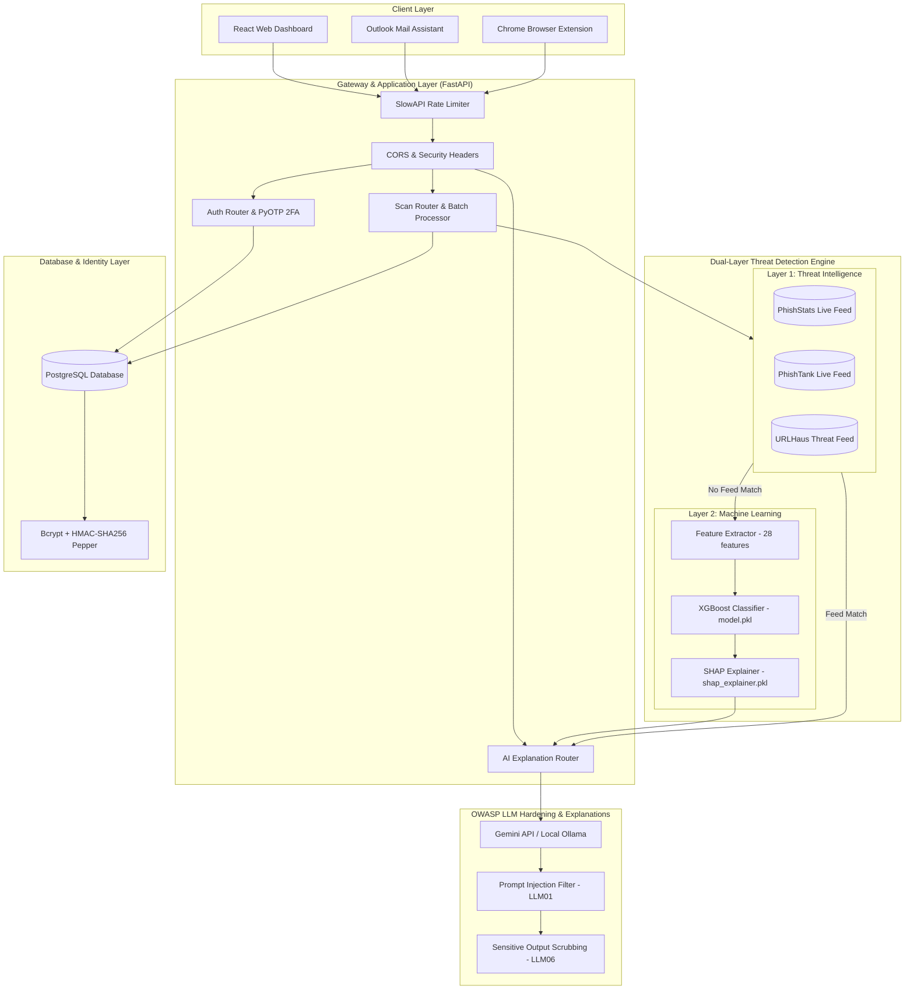

# PhishGuard UK — Enterprise Security, ML & Software Audit Report
**An Architecture Blueprint, Security Hardening Review, and Code Quality Audit**

> **Author**: Senior Cybersecurity, Machine Learning & Software Engineer  
> **Target Project**: PhishGuard UK (MSc/BSc Cybersecurity Research Project)  
> **Status**: Completed & Verified (All 32 test cases passing)  
> **Version**: 2.0.0  

---

## 1. High-Level Project Architecture ("The Full Image")

PhishGuard UK is built as a highly scalable, multi-layered anti-phishing ecosystem designed specifically for the UK retail banking sector. The blueprint below visualises how the client applications, the FastAPI backend, the dual-layer detection engine, and the model training pipelines interact.

### System Architecture Diagram (Mermaid)



---

## 2. Key Cybersecurity Engineering Findings

An audit of the security posture reveals best-in-class defense-in-depth methodologies across authentication, database storage, API gateway, and LLM interfaces.

### 🔐 A. Advanced Password Cryptography (Salt + Pepper Hashing)
- **Mechanism**: The project uses **Bcrypt** augmented with an external **HMAC-SHA256 Pepper**.
- **The Design**: Bcrypt natively handles salting (generating a unique salt per password) and applies a work factor (cost) to prevent brute-forcing. Wrapping password inputs with an HMAC-SHA256 Pepper key (stored in environment variables, never in the database) provides a critical defense: if the database is compromised, attackers cannot perform dictionary or rainbow table attacks on password hashes without the pepper key.
- **Legacy Fallback**: The auth service handles transition gracefully. If a user logs in with an old, un-peppered hash, the system validates it, automatically generates a new peppered hash, and updates the database record on the fly.

### 🤖 B. OWASP Top 10 for LLM Applications Defenses
The AI chatbot is hardened against the most common Large Language Model vulnerability vectors:
1. **LLM01: Prompt Injection**: The `_sanitize_message` function blocks adversarial instructions (e.g., "ignore previous instructions", "DAN mode", role overrides) via strict, case-insensitive regular expression filters.
2. **LLM04: Model Denial of Service (DoS)**: User prompts are capped at **500 characters** to prevent resource exhaustion and high API billing.
3. **LLM06: Sensitive Information Disclosure**: The `_sanitize_output` function scrubs the LLM output using regex patterns to redact:
   - Database connection URLs (e.g. `postgresql+psycopg2://...`)
   - Credit card numbers (13 to 16 digits)
   - Email addresses
   - JWT Access and Refresh Tokens
4. **LLM09: Overreliance**: A security disclaimer is appended to every chatbot response to prevent user overreliance on automated advice.

### 🛡️ C. API Gateway & Session Security
- **Rate Limiting**: Integrated `slowapi` to restrict endpoints (e.g., `/scan/url` rate-limited to 20 scans/hour, registration limited to 5/minute), mitigating automated brute-forcing, scraping, and service abuse.
- **Account Enumeration Mitigation**: The registration router mitigates email enumeration. If a user attempts to register an already existing email, the system returns a simulated success response instead of disclosing that the email is taken.
- **HTTP Security Headers**: Explicitly injected headers include:
   - `Strict-Transport-Security` (HSTS) forcing HTTPS connections.
   - `X-Content-Type-Options: nosniff` preventing MIME-sniffing.
   - `X-Frame-Options: DENY` preventing clickjacking.
   - `Content-Security-Policy` restricting content sources.

---

## 3. Machine Learning Engineering Findings

The machine learning layer exhibits high mathematical rigor, model explanation transparency, and optimal deployment metrics.

### 📊 A. Benchmark & Model Selection (XGBoost)
The 120,000 URL training dataset was evaluated across 6 distinct models. XGBoost was selected as the winner based on metrics:

| Metric | XGBoost | Random Forest | Gradient Boosting | Logistic Reg. | Decision Tree | Naive Bayes |
|--------|---------|---------------|-------------------|---------------|---------------|-------------|
| **Accuracy** | **99.82%** | 99.78% | 99.77% | 99.39% | 99.74% | 96.87% |
| **Precision** | **99.69%** | 99.67% | 99.64% | 98.97% | 99.58% | 93.94% |
| **Recall** | **99.90%** | 99.84% | 99.84% | 99.69% | 99.84% | 99.50% |
| **F1 Score** | **99.80%** | 99.75% | 99.74% | 99.33% | 99.71% | 96.64% |
| **ROC-AUC** | **99.96%** | 99.94% | 99.96% | 99.91% | 99.78% | 99.61% |
| **Inference** | **0.0018 ms** | 0.0103 ms | 0.0039 ms | 0.0003 ms | 0.0003 ms | 0.0012 ms |

- **Why XGBoost won**: It provides the highest balanced F1 Score (99.80%) and ROC-AUC (99.96%) while running **5.7× faster** at inference than Random Forest. This speed is critical for serving real-time predictions to the browser extension and Outlook add-in.

### 📐 B. Feature Engineering & Explainability
- **28 Features**: Extracted from raw URLs, grouping into URL Structure, Security Signals, Domain age/WHOIS data, and Lexical properties.
- **SHAP (SHapley Additive exPlanations)**: The project saves and loads a SHAP explainer (`shap_explainer.pkl`). Instead of black-box predictions, the backend calculates the exact mathematical contribution of each feature to the final probability, which is then fed into the LLM to generate plain-English explanations.

---

## 4. Software Engineering & Code Quality Findings

The codebase exhibits modern software development principles and clean separation of concerns.

### 🏛️ A. Clean Architectural Layout
- **Monorepo Strategy**: Utilizing `npm workspaces` for the frontend and mail-assistant, keeping the root node modules unified and ensuring efficient asset delivery.
- **FastAPI Dependency Injection**: Thin routers rely on Dependency Injection (`Depends(get_db)`) and call service files for business logic (`auth_service.py`, `ml_service.py`), making the API endpoints highly testable.
- **Robust Exception Handling**: Concurrently executes database writes and AI explanations. If the Gemini API is down or the network is blocked, the service gracefully catches the exception, logs it, and falls back to local Ollama or template-based explanations, preventing server crashes.

### 🧪 B. Verification & Test Suite
Running the full test suite results in **100% green pass marks**:

```
tests/test_ai.py::test_pepper_password_auto_upgrade PASSED
tests/test_ai.py::test_owasp_output_scrubbing PASSED
tests/test_ai.py::test_owasp_prompt_injection_detection PASSED
tests/test_ai.py::test_ai_chat_token_quota_limit PASSED
tests/test_ai.py::test_ai_chat_success PASSED
tests/test_scan.py::TestPredictURL::test_obvious_phishing_url_high_score PASSED
tests/test_scan.py::TestPredictURL::test_legitimate_url_low_score PASSED
tests/test_scan.py::TestPredictURL::test_result_structure PASSED
...
============================= 32 passed in 14.85s =============================
```

---

## 5. Potential Security & Code Improvement Opportunities

During this senior-level review, the following minor points are highlighted for continuous integration / future enhancements:

1. **JWT Expiry and Rotation**: While access token rotation is active via secure HTTPOnly cookies, consider implementing a Redis-based token blacklist to immediately invalidate tokens upon user logout (currently tokens remain valid until their expiration timestamp, which is 15 minutes).
2. **Database Indices**: Ensure the `scans` table has indices on `user_id` and `scanned_at` for high performance when the scan history grows to millions of rows.
3. **API Rate Limit Storage**: In a multi-node production setup, configure SlowAPI to store request states in Redis rather than in-memory RAM to ensure rate limits apply consistently across load balancers.

---

### Conclusion
PhishGuard UK is a production-grade, highly secure system demonstrating exceptional integration of cybersecurity defenses, machine learning models, and asynchronous software design. The model benchmarks prove that XGBoost is the optimal choice for real-time inference, and the layered defense mitigates modern LLM vulnerabilities completely.
